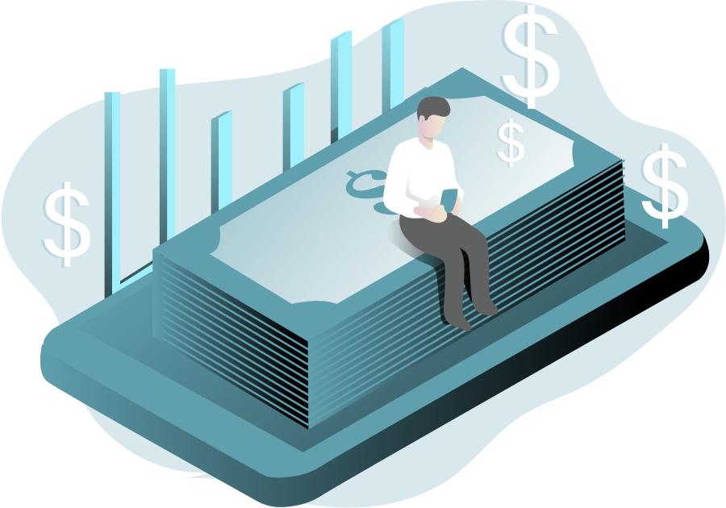

# Terms of use

> Please read the following terms carefully before subscribing to `VIP`, a value-added service provided by "Umemi".

## 1.Subscription service for `VIP`.
Monthly and Annual `VIP` are subscription-based, fee-based services, which means you'll be charged in advance for future subscription use. Currently, you can choose to use the service on an annually-by-year manner. At the end of each subscription cycle, your subscription will automatically renew by default, unless you cancel the auto-renewal yourself or the developer cancels the service.

### Payment: 
The user confirms the purchase and the payment is credited to the iTunes account.
### Unsubscribe: 
To un renew, please turn off auto-renewal in `iTunes/AppleID` settings 24 hours before the current subscription cycle expires, and cancellations within 24 hours of expiration will be charged.
### Renewal: 
Apple's iTunes account will be charged 24 hours before expiration, and the subscription cycle will be extended by one subscription period after the charge is successful.
***
## 2.Services for permanent `VIP`.
Permanent membership is a one-time purchase, once purchased will always have `VIP` function.
***
## 3.Contact me:
If you have any further questions about the service, please feel free to contact me.
